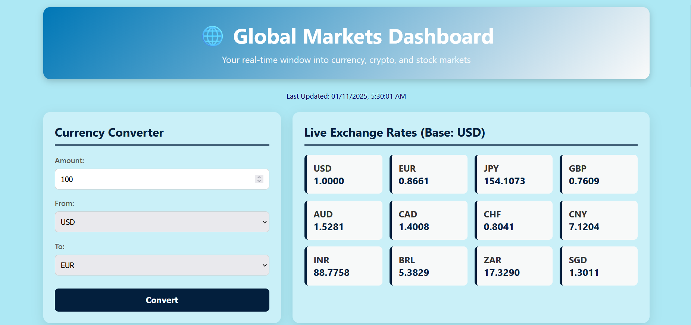

# Global Markets Dashboard

A comprehensive, single-page web application that provides a real-time overview of global financial markets. This dashboard brings together currency exchange rates, cryptocurrency prices, major stock market data, and the latest financial news into one convenient and easy-to-use interface.



## Features

*   **Real-time Forex Rates:** View live exchange rates for major global currencies.
*   **Instant Currency Converter:** Convert amounts between different currencies with up-to-the-minute rates.
*   **Cryptocurrency Tracker:** Monitor the prices of major cryptocurrencies like Bitcoin and Ethereum.
*   **Stock Market Overview:** Keep an eye on the stock prices of leading companies (e.g., Apple, Google, Amazon).
*   **Latest Financial News:** Stay informed with an integrated feed of market-related news.
*   **All-in-One Interface:** A single, clean dashboard for all your market data needs.

## Technology Stack

### Backend
*   Python
*   Flask

### Frontend
*   HTML
*   CSS
*   JavaScript

### Data APIs
*   [ExchangeRate-API](https://www.exchangerate-api.com/) for forex rates.
*   [GNews](https://gnews.io/) for financial news.
*   [CoinGecko](https://www.coingecko.com/en/api) for cryptocurrency prices.
*   [Finnhub](https://finnhub.io/) for stock prices.

## Setup and Installation

To get this application running on your local machine, follow these steps.

### 1. Prerequisites

Make sure you have Python 3 installed.

### 2. Clone the Repository

```bash
git clone https://github.com/imjimit07/Currency-Conversion.git
cd Currency-Conversion
```
*(Note: Replace the URL with the actual URL of your repository.)*

### 3. Install Dependencies

This project uses the `Flask` and `requests` libraries. You can install them using pip:

```bash
pip install Flask requests
```

### 4. Get API Keys

This application requires API keys from three different services. All of them offer free tiers that are sufficient for this project.

*   **ExchangeRate-API:** Go to [https://www.exchangerate-api.com/](https://www.exchangerate-api.com/) and sign up for a free key.
*   **GNews:** Go to [https://gnews.io/](https://gnews.io/) and get a free API key.
*   **Finnhub:** Go to [https://finnhub.io/](https://finnhub.io/) and register for a free API key.

### 5. Configure the Application

Open the `App.py` file and replace the placeholder API key values with the keys you obtained in the previous step:

```python
# App.py

EXCHANGERATE_API_KEY = "your_exchangerate_api_key"
GNEWS_API_KEY = "your_gnews_api_key"
FINNHUB_API_KEY = "your_finnhub_api_key"
```

## How to Run

1.  **Start the Server:**
    Run the following command in your terminal from the project's root directory:
    ```bash
    python App.py
    ```

2.  **Access the Dashboard:**
    Open your web browser and navigate to:
    [http://127.0.0.1:5000](http://127.0.0.1:5000)

## License

This project is licensed under the GNU General Public License v3.0.

## Contributors

*   [@imjimit07] - Initial development, feature implementation, FinnHub and CoinGecko API implementation, etc.
*   [@HimanshuMerani123] - ExchangeRate API documentation, implementation, etc.
*   [@Husain53100] - UI/UX development.
*   [@James420-error] - API Bug fixes, documentation.
*   [@Savanpatel-108] - GNews.io API implementation and documentation.